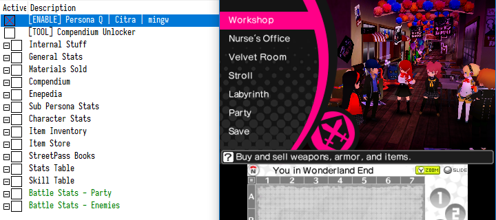
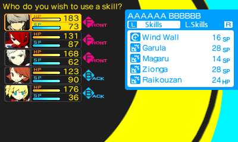
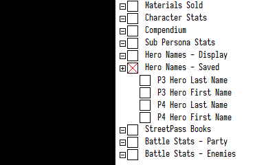
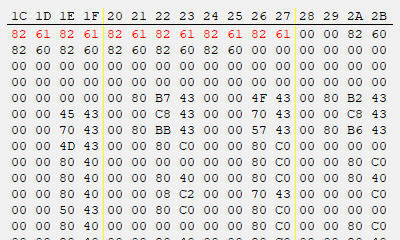
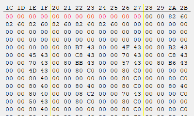
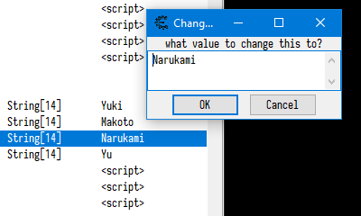

# Persona Q Cheat Table

A cheat table for __Persona Q__, a game developed by Atlus, for use while playing on Citra.

__WARNING:__ Generally untested, use at your own discretion, don't blame me for borked saves, etc.

__NOTE:__ The table is mostly dynamically generated, due to some limitations opening certain group records for the first time can take a while.

## Prerequisites

* Latest Cheat Engine release.
* Latest Citra release - This table only works with _mingw_ Citra builds, and was only tested under the _nightly_ releases.
* Persona Q. - This table has been tested with the undubbed US version, `CTR-AQQE`, together with the undubbed DLC.

## Installation

1. Download and install Cheat Engine (or use the portable version).
2. Clone or download this repository.

## Usage

1. Open Citra and launch __Persona Q__.
2. Open Cheat Engine and attach it to the Citra process.
3. Load the `citra-pq.CT` table. If prompted, allow the main table script to run.
4. Enable the table via the `[ENABLE]` script at the top.

---

## Table Contents

Most stuff should be self-explanatory; however, some notes may be required:

### Passive Effects

The __Passive Effect__ is the currently active item effect when roaming the labyrinth.
For example, to avoid all random enemy encouters, set the passive effect to `4796` (Repulse Bell) and freeze __Passive Effect Steps__ to 50 or some other non-zero value.

### Play Time

__Play Time__, `t`, is measured using the following relationship: `t = 30 * 60 * (60 * h + m)`, where `h` and `m` are the number of hours and minutes played respectively.

### Party Gauge

The __Party Gauge__ appears to the right during each battle and is used for invoking Leader Skills.
The maximum meter level is 5 and each level is composed of 100 ticks, so 500 ticks will max out the meter.

### User Input Strings

__Names__ and other user input strings in the game are encoded in SHIFT-JIS (each character is 2 bytes) and are all `\0` terminated.
However, ASCII (where each character is 1 byte) is a subset of SHIFT-JIS, and is fully supported by the game.

Examples for user input strings are the __P3 Hero__ and __P4 Hero__ names. Usually, these are limited to 6 chars, but are stored in memory as 14 bytes: `(14 - 1) // 2 == 6` (for the first name and last name each). However, these can be edited as ASCII strings (1 byte per character), thus increasing the total character limit per name to 13 chars: `(14 - 1) // 1 == 13`.

To edit a string, e.g. the __P4 Hero__ name, use the following process:

1. Highlight a name record and press `Ctrl+B` to browse the memory at that address.
2. Zero out the bytes from that point up to the closest `00` byte.
3. Then, use the table to edit the name to the desired ASCII string.
4. Do this for both the first and last name.
5. Save and load the game.

Other strings can be edited in a similar fashion.
You can also edit the string using just the memory viewer, in which case you could also use SHIFT-JIS encoding.

|                      |                      |                      |
|:--------------------:|:--------------------:|:--------------------:|
|  |  |  |
|  |  |  |

### Compendium

You can use the __Compendium Unlocker__ tool to unlock various personas in the compendium.
Pressing the `UNLOCK ALL` button will only unlock personas you haven't unlocked yet and will not overwrite your saved personas.
Pressing the `LOCK ALL` button will erase the entire compendium, _including any personas you've already unlocked_.

Use the records under the __Compendium__ header to edit individual persona stats.

### Enepedia

Setting the value of records under this header to `FF FF` will reveal all enemy stats in the Enepedia.

### Inventory and Item Store

The items within the __Item Inventory__ can only be edited via the table - adding and removing items is not supported.
To add an item, buy a cheap item and edit it via the table, or create the item in the __Item Store__ and retrieve it from there.

### Battle Stats

__Battle Stats__ allow you to edit character and enemy stats while in battle. Note that these stats are dynamic and are only allocated by the game while in battle.

It's recommended __not__ to freeze any of the values under these records.
